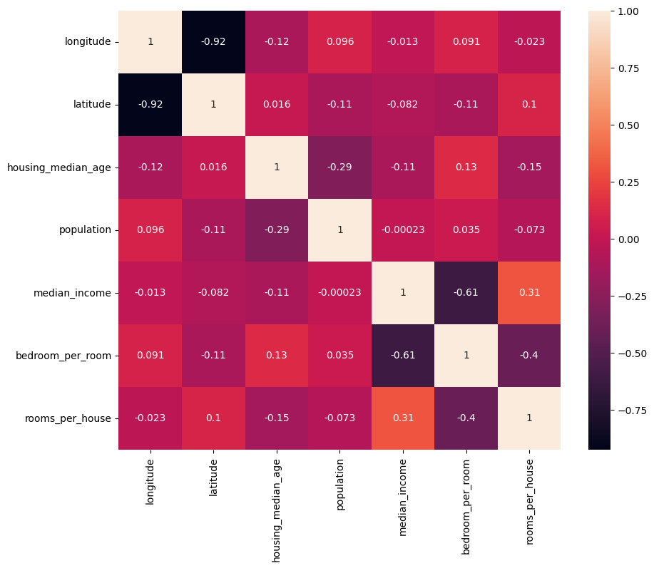
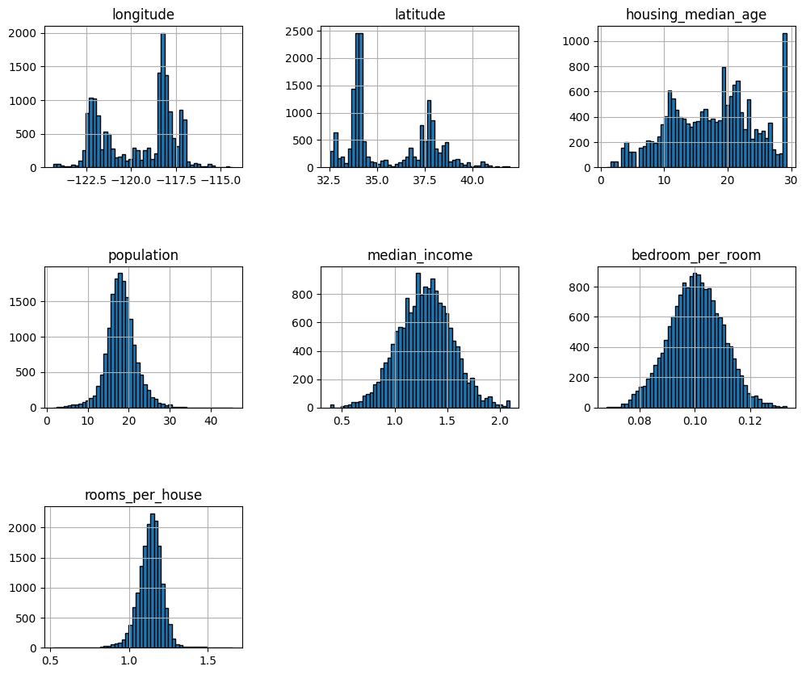

### Analysis of implementing Multiple Linear Regression in California Housing Dataset using Sckit-Learn:
I used `LinearRegression` class of the `sklearn.linear_models` of Scikit-Learn Library.

#### Benchmarks:
`R2 Score`:  0.6108644970184367
`Cross validation R2 Score`: 0.6233070635724488

#### Challenges Faced:
1. Data Cleaning: The dataset was already pre-cleaned for the most-parts. There was only one column which had missing values which less than I expected. I had two choices, either impute the missing values via a simple categorical imputer of sklearn or remove the null values entirely, I choose to remove the missing values in the `total_rooms`column as there weren't a lot of missing values.
2. Feature Engineering: A few features of the dataset were less interpretable didn't offer much insight in the data such as `total_rooms`, `total_bedrooms` and `households` instead I did some feature construction and converted these features to `bedroom_per_room` and `rooms_per_house` which were much more interpretable.

#### Exploratory Data Analysis:
1. High Multicolinearity: There a strong correlation(0.9+) between two feature in the dataset, `Latitude` and `Longitude`. This technically doesn't matter much but the interpretability decreases and the redunancy of features increases. It would've been much better if instead of the coordinates of the house, we labled their area or their locality.

2. Capping of data: Two columns in the data,`median_house_value` and `housing_median_age` are capped at ~500000 $ and ~52 years. This might lead the model into thinking that the a value of a house and age of a house cannot go above the capped limit.

3. Log normal distributions: In the histograms of `median_income`, `median_house_value` and `bedroom_per_room` we see that the values are skewed to the left that means that a lot of people earn less and lesser people earn more and the more people purchase a smaller house and less people purchase a bigger house. We can do a transformation to make these disstributions like the Normal Distributions or we can standardize them.
I did apply the `Yeo-Johnson` Transform to the skewed distributions but it led to consistent drop in R2 Score and Cross-validation score:

R2 Score became: ~56
Cross val score: ~0.57

