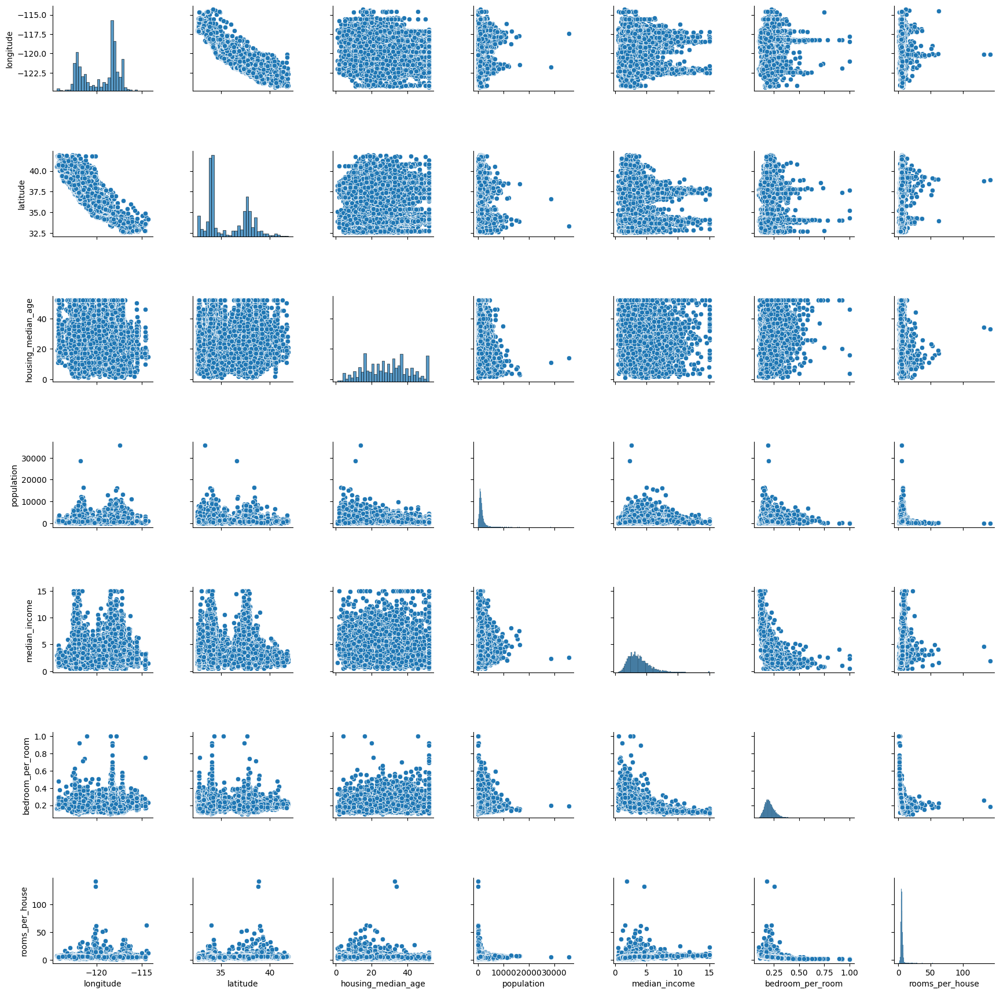
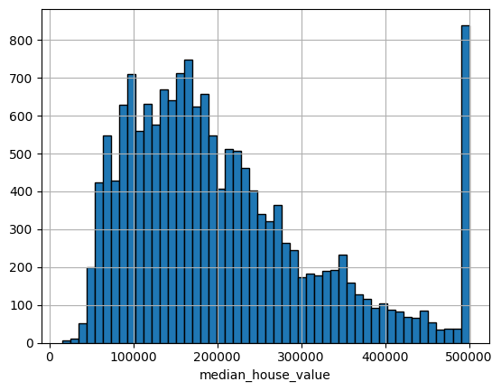
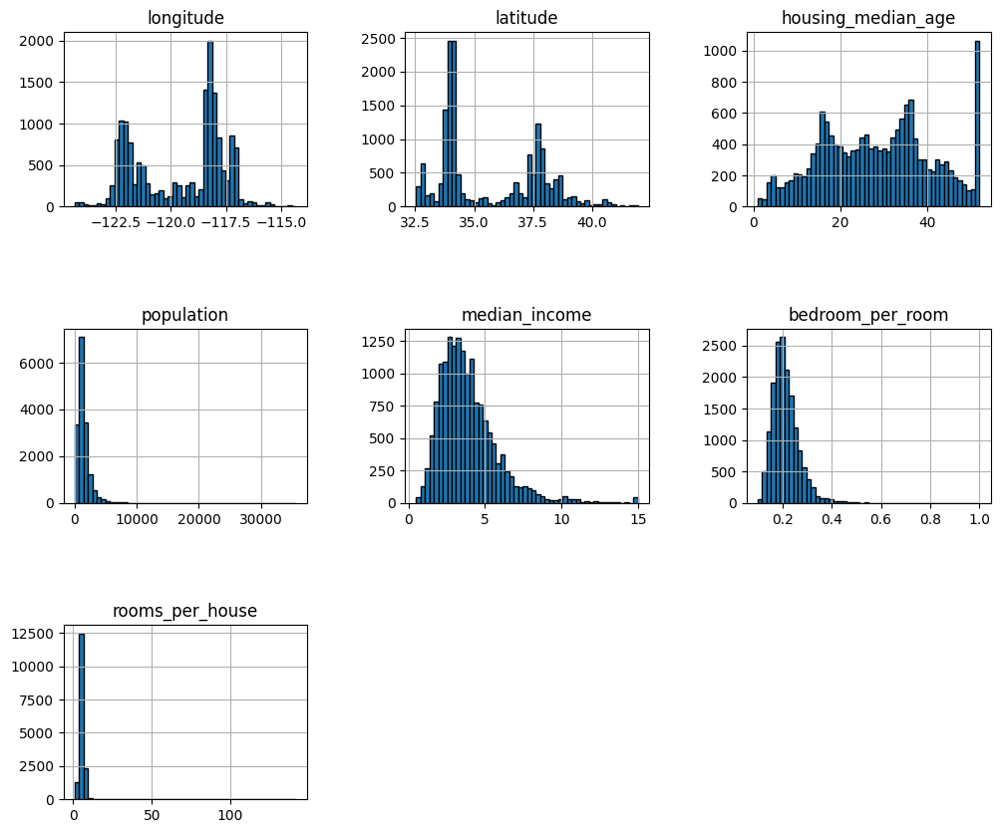

### **Analysis of implementing Ridge, Lasso and ElasticNet Regression in California Housing Dataset using Sckit-Learn:**
I used `Ridge`, `Lasso` and `ElasticNet` class of the `sklearn.linear_models` of Scikit-Learn API/Library.

### **Problem Statement/Aim:**
To compare various regularization algorithmic techniques which are L2 Regularization(Ridge), L1 Regularization(Lasso), and ElasticNet Regularization

 

#### Exploratory Data Analysis:
1. **High Multicolinearity:** There a strong correlation(0.9+) between two feature in the dataset, `Latitude` and `Longitude`. This technically doesn't matter much but the interpretability decreases and the redunancy of features increases. It would've been much better if instead of the coordinates of the house, we labled their area or their locality.

2. **Capping of data:** Two columns in the data,`median_house_value` and `housing_median_age` are capped at ~500000 $ and ~52 years. This might lead the model into thinking that the a value of a house and age of a house cannot go above the capped limit.

3. **Log normal distributions:** In the histograms of `median_income`, `median_house_value` and `bedroom_per_room` we see that the values are skewed to the left that means that a lot of people earn less and lesser people earn more and the more people purchase a smaller house and less people purchase a bigger house. We can do a transformation to make these disstributions like the Normal Distributions or we can standardize them.
I did apply the `Yeo-Johnson` Transform to the skewed distributions but it led to consistent drop in R2 Score and Cross-validation score:

R2 Score became: ~56
Cross val score: ~0.57

 

#### Challenges Faced:
1. **Data Cleaning:** The dataset was already pre-cleaned for the most-parts. There was only one column which had missing values which less than I expected. I had two choices, either impute the missing values via a simple categorical imputer of sklearn or remove the null values entirely, I choose to remove the missing values in the `total_rooms`column as there weren't a lot of missing values.

2. **Feature Engineering:** A few features of the dataset were less interpretable didn't offer much insight in the data such as `total_rooms`, `total_bedrooms` and `households` instead I did some feature construction and converted these features to `bedroom_per_room` and `rooms_per_house` which were much more interpretable.

3. **Feature Scaling:** Unlike Linear Regression which is scale-invariant, Ridge, Lasso and ElasticNet are not scale invariant as we add more bias to the loss function and the bias depends the scale of the features as the feature which is *up-scaled* will have a higher penalty compared to a feature who was *down-scaled*.

4. **Hyperparameter Tuning:** As Ridge, Lasso and ElasticNet have hyperparameters(which are user-defined) hyperparameter tuning is need for better performance.
 For that i used Scikit-Learn's `GridSearchCV` and `RandomSearchCV`

 

#### Benchmarks(Before Hyperparameter Tuning):
`Ridge RMSE Score:` 70662.20406085561
`Lasso RMSE Score:` 70643.5589479336
`ElasticNet RMSE Score:` 79726.58587785337
`Linear RMSE Score:` 70641.9927245615

`Ridge R2 Score:` 0.6106417945342879
`Lasso R2 Score:` 0.6108472415630742
`ElasticNet R2 Score:` 0.5043429293305954
`Linear R2 Score:` 0.6108644970184367

`Ridge Cross validation R2 Score:` 0.623271782052597
`Lasso Cross validation R2 Score:` 0.6233070635724488
`ElasticNet Cross validation R2 Score:` 0.6233070635724488
`Linear Cross validation R2 Score:` 0.623307063572448
 

#### Benchmarks(After Hyperparameter Tuning):

`Ridge RMSE Score:` 70738.64039255804 
`Lasso RMSE Score:` 70777.11988595528 
`ElasticNet RMSE Score:` 70777.16539593672 
`Linear RMSE Score:` 70641.9927245615 

`Ridge R2 Score:` 0.6097989901000448 
`Lasso R2 Score:` 0.6093743616123537 
`ElasticNet R2 Score:` 0.6093738592643834 
`Linear R2 Score:` 0.6108644970184367 

`Ridge Cross validation R2 Score:` 0.623271782052597
`Lasso Cross validation R2 Score:` 0.6233070635724488
`ElasticNet Cross validation R2 Score:` 0.6233070635724488
`Linear Cross validation R2 Score:` 0.6233070635724488
 

#### `GridSearchCV` and `RandomizedSearchCV` results
`Ridge Best params:` {'model__alpha': np.float64(9.183673469387756)} 
`Ridge Best R2 score`: 0.6234735437325709 
`Lasso Best params:` {'model__alpha': np.float64(24.491836734693877)} 
`Lasso Best R2 score`: 0.6234713386516938 
`ElasticNet Best params:` {'model__l1_ratio': np.float64(1.0), 'model__alpha': np.float64(29.183673469387756)}
`ElasticNet Best R2 score:` 0.6234712997159871

 
 

#### Key Mistakes/Takeaways:
1. **Not Using The `GridSearchCV` and `RandomizedSearchCV` objects as THE estimator/model:**  I thought that the function of `GridSearchCV` and `RandomizedSearchCV` object is only to search the best hyperparameters and after finding the best hyperparameters we need to manually assign each hyperparameter to the model manually but, it can also be used as an model/estimator itself.
[More about it here](https://scikit-learn.org/1.5/modules/generated/sklearn.model_selection.GridSearchCV.html)

#### Limitations:
1. **Toy Dataset-like quality:**
Even this is a real dataset, but it's still very well polished and maintained and is consistent unlike the other datasets which are messy, have missing values, inconsistent units, irrelevant features are huge in size.
2. **Simplicity:**
Extending on the first point, i want to say that my approaches for data processing, exploratory data analysis, pipeline-construction are very simple and easy and are not scalable and robust to handle real world big data.
3. **Model Selection:** Linear Algorithms suffer from underfitting and plateu in performance in California Housing dataset as many feature show non-linear relationships with the response variable.

### **Conclusion:**
Ridge(L2), Lasso(L1) and ElasticNet are powerful regularization techniques which can be used in regression specifically in overfitting but in this problem the regularization was not actually needed as the Linear Regression was performing the same all by itself as seen from the benchmarks.